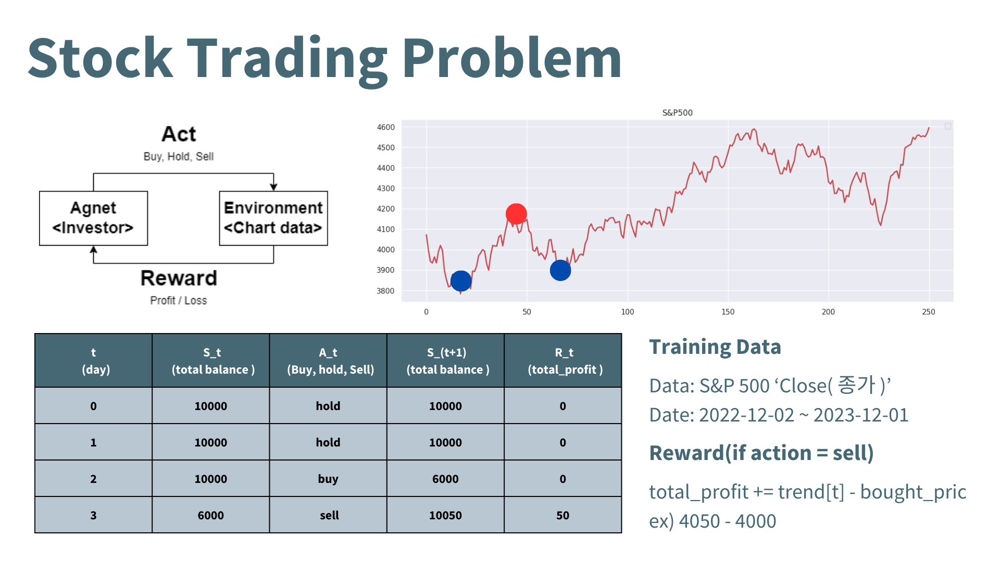
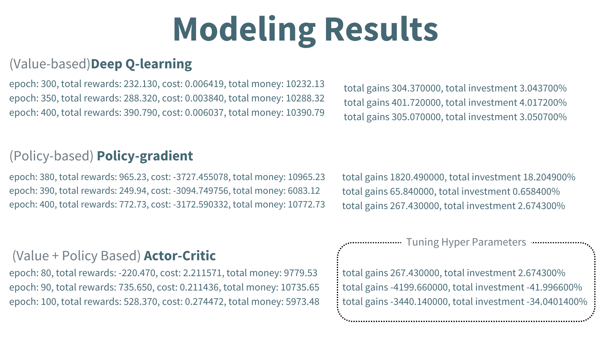
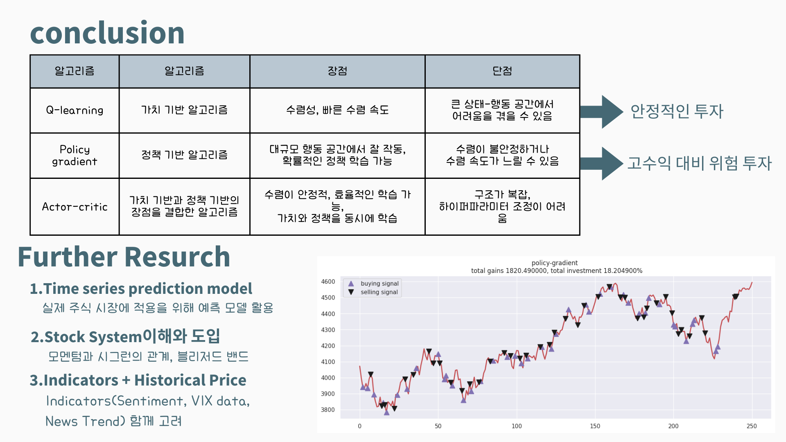

# StockTradingAI

This project is a reinforcement learning final project.
It is a Stock Trader trained to trade stocks from the S&P 500. 
It was made using a Deep Q-Learning, Policy gradient, Actor-critic model and libraries such as TensorFlow, Keras.

